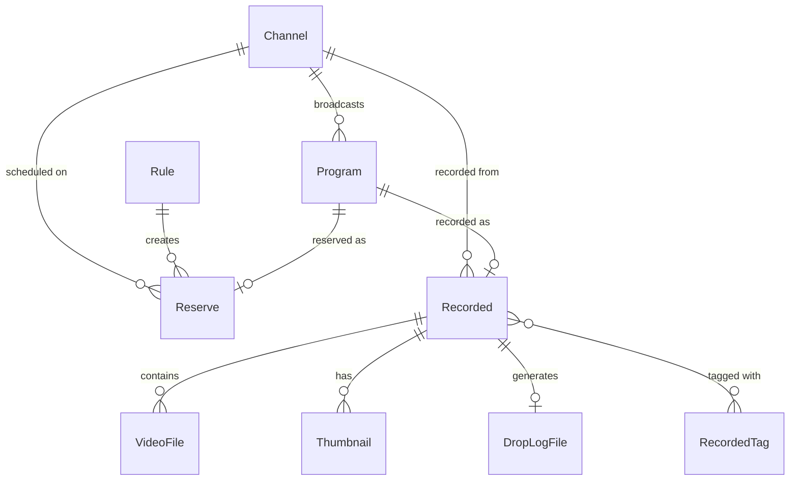

# Database Architecture and Optimizations

EPGStation uses [TypeORM](https://typeorm.io/) as its ORM (Object-Relational Mapper) to interact with its underlying database. While MySQL and PostgreSQL are supported, SQLite is the default and primarily focused engine.

## Database Entities

The `src/db/entities` directory contains the schema models. The major entities include:

*   **Channel**: TV stations/channels.
*   **Program**: EPG (Electronic Program Guide) TV show listings.
*   **Reserve**: Scheduled recording reservations (both manual and rule-based).
*   **Rule**: Automated recording rules (e.g., "Record all shows containing 'News' on Channel X").
*   **Recorded**: Completed or in-progress recordings.
*   **VideoFile / Thumbnail / DropLogFile**: Metadata for generated media and log artifacts.

### Entity Relationship Diagram (Mermaid)



## Performance & Concurrency Optimizations

Because EPGStation performs intensive, concurrent reads and writes (e.g., pulling hundreds of EPG listings via an `EPGUpdater` background task while the streaming or recording engines read/write to the same files), several specific optimizations have been applied to SQLite:

### 1. SQLite WAL and Busy Retry

SQLite normally locks the entire database file during writes (`SQLITE_BUSY`).
In `src/model/db/DBOperator.ts`, the TypeORM DataSource is explicitly configured to handle concurrency:

*   `enableWAL: true`: Turns on Write-Ahead Logging in SQLite, dramatically improving read/write concurrency.
*   `busyErrorRetry: 1000`: Tells TypeORM's internal `SqliteQueryRunner` to catch `SQLITE_BUSY` errors and retry the query after a brief timeout instead of fatally crashing the application. This shields the application layer (`ReservationManageModel`, `EPGUpdateManageModel`, etc.) from transient locking issues.

### 2. Batch Chunked Inserts

Mass updates, such as inserting thousands of `Program` or `Reserve` rows during an EPG update, historically caused performance bottlenecks when iterated via `for...of` loops:

```typescript
// INEFFICIENT (Old way)
for (const program of programs) {
    await queryRunner.manager.insert(Program, program);
}
```

This produced 5,000 separate SQL `INSERT` statements inside a transaction, blocking the event loop and hogging the database lock.

The code is optimized to use **Batch Chunked Inserts**. TypeORM's `insert()` natively supports arrays, compiling them into massive bulk SQL queries (e.g., `INSERT INTO table VALUES (x), (y), (z)...`). Since SQLite has a max variable limit, arrays are chunked:

```typescript
// OPTIMIZED (New way)
const chunkSize = 500;
for (let i = 0; i < programs.length; i += chunkSize) {
    const chunk = programs.slice(i, i + chunkSize);
    await queryRunner.manager.insert(Program, chunk);
}
```

This approach compresses thousands of queries down to a handful of bulk statements, reducing transaction duration by orders of magnitude and minimizing `SQLITE_BUSY` contention across the platform.

### 3. Application-Level Execution Queue

Even with `busyErrorRetry`, massive background jobs shouldn't overlap indiscriminately. The `ExecutionManagementModel` serves as a Node.js-level priority queue. Any operator wishing to modify the database (e.g., updating reservations) must await `getExecution()` to acquire the lock token. This ensures serialized high-level operations, reducing the load on the database engine's internal retry mechanisms.
